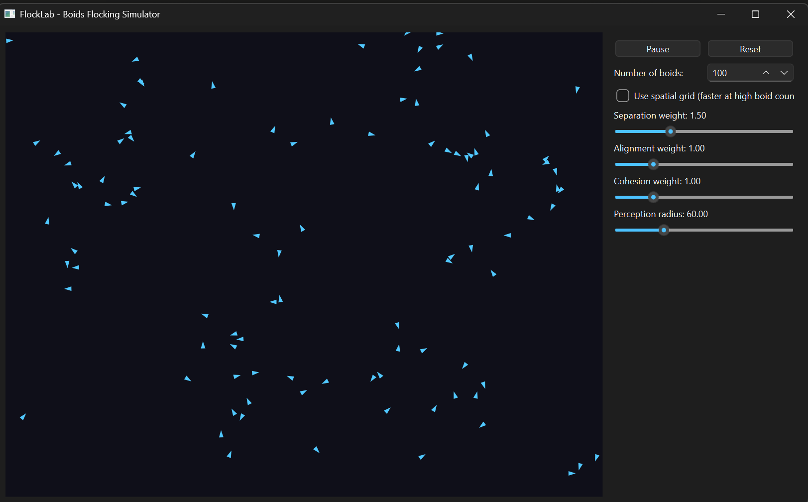

# FlockLab

A real-time multi-agent flocking simulator (Craig Reynolds' Boids algorithm) with an interactive PySide6 desktop GUI. Built as a research-software practice project — simulate, visualize, and tune collective motion models live.

## Demo



*100 boids with separation=1.5, alignment=1.0, cohesion=1.0, perception radius=60 — organic clustering with no rigid block movement.*

## Features

- Real-time simulation of hundreds of agents following 3 local rules: separation, alignment, cohesion
- Interactive control panel — tune rule weights, perception radius, and boid count live via sliders, with play/pause/reset
- Two neighbor-search modes: brute-force O(N^2) and a spatial-grid O(N*k) mode, toggleable at runtime, ~4x faster at 1000 agents

## Project Structure

```
flocklab/
├── simulation.py    # Pure NumPy simulation engine (Boid/Flock/SpatialGrid) - no Qt dependency
├── canvas.py         # QWidget rendering layer (QPainter + QTimer)
├── controls.py       # Control panel (sliders, spin box, checkbox) wired via Qt signals/slots
├── main.py           # Entry point, assembles canvas + controls into one window
├── requirements.txt
└── README.md
```

## Setup

Requires Python 3.9+.

```bash
git clone https://github.com/dakshrathi-india/flocklab.git
cd flocklab
pip install -r requirements.txt
python main.py
```

## Usage

- **Sliders** - adjust separation/alignment/cohesion weights and perception radius while the simulation runs
- **Number of boids** - change agent count live (resets positions)
- **Use spatial grid** checkbox - switch neighbor-search method; try it at 500+ boids to feel the frame-rate difference
- **Pause / Resume / Reset** - standard playback controls

## The Algorithm

Each boid follows 3 local rules based only on neighbors within a perception radius:

1. **Separation** - steer away from boids that are too close
2. **Alignment** - steer toward the average heading of nearby boids
3. **Cohesion** - steer toward the average position of nearby boids

No boid has global knowledge of the flock - the collective motion emerges purely from these local interactions, recomputed every frame for every agent.

## Performance: Brute-Force vs Spatial Grid

Run the benchmark directly:

```bash
python simulation.py
```

Sample results (avg ms per simulation step):

| Boids | Brute-force O(N^2) | Spatial grid |
|------:|--------------------:|-------------:|
|   100 |               1.5ms |        2.2ms |
|   300 |              14.1ms |        8.3ms |
|   600 |              50.0ms |       20.9ms |
|  1000 |             147.6ms |       36.2ms |

Brute-force wins at small N (grid overhead dominates), but the spatial grid pulls ahead sharply as the flock grows - about 4x faster at 1000 agents.

## Possible Extensions

- Obstacle avoidance as a 4th steering rule
- A second model (e.g. random-walk baseline) with a dropdown to compare collective behaviors side-by-side
- Predator/prey boid types with different rule sets
- Export simulation parameters/state to JSON for reproducible runs

## License

MIT - see [LICENSE](LICENSE).
